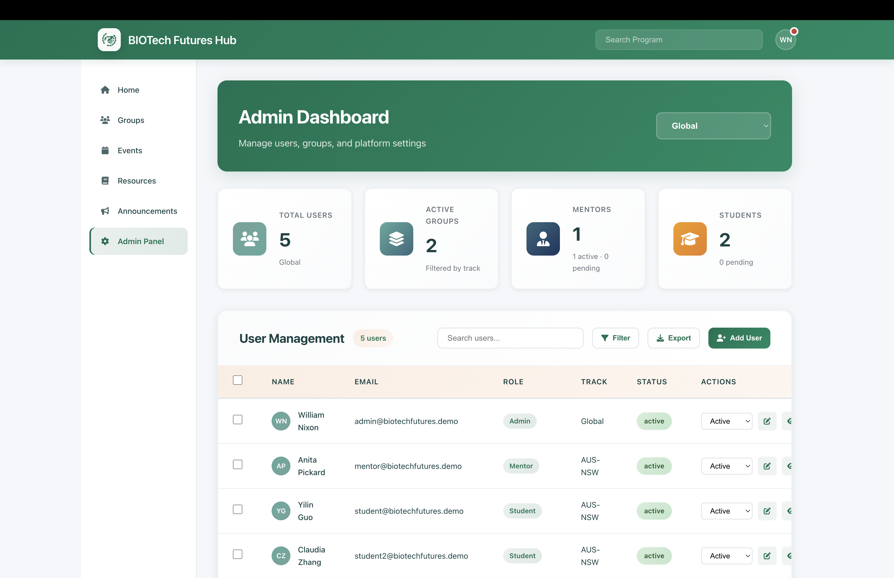

# BIOTech Futures Hub

[](https://github.com/gss10282023/BIOTech_Futures_Hub/actions/workflows/ci.yml) [](https://gss10282023.github.io/BIOTech_Futures_Hub/) [](LICENSE)  

An open-source friendly full-stack collaboration hub: passwordless login, role-based access, group workspace (milestones/tasks/discussion), content management, and an admin console.

Live demo (frontend only): https://gss10282023.github.io/BIOTech_Futures_Hub/

## Preview
[](https://gss10282023.github.io/BIOTech_Futures_Hub/)
[](https://gss10282023.github.io/BIOTech_Futures_Hub/)
[](https://gss10282023.github.io/BIOTech_Futures_Hub/)
[](https://gss10282023.github.io/BIOTech_Futures_Hub/)
[](https://gss10282023.github.io/BIOTech_Futures_Hub/)
[](https://gss10282023.github.io/BIOTech_Futures_Hub/)


---

## Core Features
- Passwordless magic link + OTP (JWT session)
- Role-based access (`admin` / `mentor` / `student` / `supervisor`)
- Group workspace: milestones, tasks, discussion (with attachments)
- Resources / Events / Announcements management and audience visibility
- Admin console: stats, user management, exports, group creation

## Technical Highlights
- Django REST Framework + Channels (WebSocket discussion)
- Vue 3 + Vite + Pinia (SPA)
- Automated tests: `tests/` + `tests/run-all-tests.sh` (backend unit/API + integration flows + frontend Vitest)

## Demo Mode (No Backend Required)
Try the UI without Postgres/Redis/backend services (powered by MSW mocks):  
```bash
cd frontend
npm install
VITE_DEMO_MODE=true npm run dev
```
The login page will show one-click demo accounts. You can also sign in with any email + any 6-digit code (local demo only).

## GitHub Pages Demo (Frontend Only)
This repo includes a GitHub Pages workflow that deploys the frontend in demo mode on every push to `main`.

1. In GitHub: `Settings` → `Pages` → `Build and deployment` → `Source`: **GitHub Actions**
2. Wait for the workflow **Deploy Frontend (GitHub Pages)** to finish
3. Open: https://gss10282023.github.io/BIOTech_Futures_Hub/

---

Full-stack application supporting the BIOTech Futures program.  
The repository contains a Django REST API (`backend/`) and a Vue 3 single-page app (`frontend/`), plus extensive documentation under `docs/`.

---

## Repository Structure
```
biotech_futures_hub/
├── README.md                     # Project overview & setup
├── LICENSE
├── CONTRIBUTING.md
├── CODE_OF_CONDUCT.md
├── SECURITY.md
├── PUBLISHING.md
├── OPEN_SOURCE_PLAN.md
├── backend/                      # Django project (REST API, auth, admin, etc.)
│   ├── manage.py
│   ├── requirements.txt
│   ├── btf_backend/              # Project settings, URLs, ASGI/WSGI
│   ├── authentication/           # Magic-link login + JWT issuance
│   ├── users/                    # Profiles, admin APIs
│   ├── groups/                   # Group, milestone, task APIs
│   ├── chat/                     # Group chat endpoints
│   ├── resources/                # Resource library APIs
│   ├── events/                   # Event APIs
│   ├── announcements/            # Announcement APIs
│   ├── core/                     # Health check, uploads, shared permissions
│   └── ...
├── frontend/                     # Vue 3 + Vite client
│   ├── package.json
│   ├── src/
│   │   ├── main.js               # App bootstrap
│   │   ├── App.vue               # Global layout + GSAP transitions
│   │   ├── router/               # Hash router with auth guard
│   │   ├── stores/               # Pinia stores (auth, groups, admin, etc.)
│   │   ├── views/                # Page components (dashboard, admin, etc.)
│   │   └── assets/styles.css     # Design tokens and global styles
│   └── ...
├── docs/                         # Project documentation
│   ├── API.md
│   ├── backend-overview.md
│   ├── frontend-overview.md
│   ├── tests-overview.md
│   └── release-notes/
├── tests/                        # Backend + frontend test suites (see docs/tests-overview.md)
├── package.json                  # Root dependency placeholder
├── package-lock.json
└── ...
```

---

## Prerequisites
- **Python** 3.11+ (virtual environment recommended)
- **Node.js** 20.19+ or 22.12+
- **PostgreSQL** and **Redis** instances (local or managed)
- Access to **Vultr Object Storage** (S3-compatible) and an **email provider** if you intend to send real magic-link emails

---

## Quick Start

### 0. Docker Compose (One-command Repro, Recommended)
```bash
./start_docker.sh
```

Equivalent manual steps:
```bash
cp backend/.env.example backend/.env
cp frontend/.env.example frontend/.env
docker compose up --build
```

- Frontend: http://localhost:5173
- Backend: http://localhost:8000 (API prefix `/api`)
- Compose runs `migrate` and seeds demo data by default (toggle `SEED_DEMO_DATA` in `docker-compose.yml`).
- Demo admin: `admin@demo.local` / `admin123456` (local demo only)
- OTP login: emails are printed to backend logs by default; run `docker compose logs -f backend` to grab the 6-digit code.

### 1. Backend (Django API)
```bash
cd backend
python3 -m venv .venv
source .venv/bin/activate        # Windows: .venv\Scripts\activate
pip install -r requirements.txt

# Create a .env file (see “Configuration” below)
python manage.py migrate
python manage.py createsuperuser  # optional
python manage.py runserver 0.0.0.0:8000
```

### 2. Frontend (Vue SPA)
```bash
cd frontend
npm install
npm run dev            # http://localhost:5173 by default
```

Point your browser to http://localhost:5173 and the SPA will proxy API calls to the backend URL configured in `VITE_API_BASE_URL`. When hosting the API and Channels server on different origins, add `VITE_API_BASE_URL` and `VITE_WS_BASE_URL` to `frontend/.env.local`.

---

## Configuration

### Environment file (`backend/.env`)
Create `backend/.env` (or use the OS environment) with values similar to:
```dotenv
# Django
SECRET_KEY=replace-me
DEBUG=True
ALLOWED_HOSTS=localhost,127.0.0.1

# Database
DB_NAME=btf_db
DB_USER=btf_user
DB_PASSWORD=btf_password_2025
DB_HOST=127.0.0.1
DB_PORT=5432

# Redis cache / OTP storage
REDIS_URL=redis://127.0.0.1:6379/1

# Frontend origin used in magic links
FRONTEND_BASE_URL=http://localhost:5173
MAGIC_LINK_EXPIRY_SECONDS=600

# Email defaults (override for real SMTP providers)
EMAIL_BACKEND=django.core.mail.backends.console.EmailBackend
DEFAULT_FROM_EMAIL=noreply@biotechfutures.org
```

The sections below explain how to switch Vultr object storage and configure a production email provider.

---

### Frontend environment (`frontend/.env` or `.env.local`)
```dotenv
VITE_API_BASE_URL=http://127.0.0.1:8000/api
VITE_WS_BASE_URL=ws://127.0.0.1:8000
```

- `VITE_API_BASE_URL`: base URL (including `/api`) used for REST calls.
- `VITE_WS_BASE_URL`: optional explicit WebSocket origin for real-time chat. When omitted, the app derives it from `VITE_API_BASE_URL` and automatically switches to `ws://` or `wss://` with the `/ws/chat/...` suffix.

---

## Switching Vultr Object Storage (S3 Compatible)
Magic-link emails and file uploads rely on Django’s storage backend. By default the project stores uploads on the local filesystem; to use Vultr Object Storage:

1. **Enable the S3 backend**  
   Ensure these packages are installed (already listed in `requirements.txt`): `django-storages`, `boto3`.

2. **Set environment variables** in `backend/.env`:
   ```dotenv
   DEFAULT_FILE_STORAGE=storages.backends.s3boto3.S3Boto3Storage
   AWS_ACCESS_KEY_ID=<YOUR_VULTR_ACCESS_KEY>
   AWS_SECRET_ACCESS_KEY=<YOUR_VULTR_SECRET_KEY>
   AWS_STORAGE_BUCKET_NAME=<YOUR_BUCKET_NAME>
   AWS_S3_ENDPOINT_URL=https://<region>.vultrobjects.com
   AWS_S3_REGION_NAME=<region>         # e.g. sjc1
   AWS_S3_ADDRESSING_STYLE=virtual     # or auto
   AWS_DEFAULT_ACL=public-read         # adjust to your needs
   ```

3. **Optional domain customisation**  
   If you use a CDN or custom domain, set `AWS_S3_CUSTOM_DOMAIN` accordingly so generated URLs match your domain.

4. **Collect static files** (if serving frontend assets from Django) with `python manage.py collectstatic`.

5. **Restart the backend** so the new configuration is applied. New uploads (resources, event covers, chat attachments) will now write to Vultr.

---

## Updating the Magic-Link Email Provider
The authentication flow emails users a magic link and a 6-digit OTP. To use a real SMTP or ESP (e.g., SendGrid, Mailgun):

1. **Choose an email backend**
   - For plain SMTP:
     ```dotenv
     EMAIL_BACKEND=django.core.mail.backends.smtp.EmailBackend
     EMAIL_HOST=smtp.sendgrid.net
     EMAIL_PORT=587
     EMAIL_USE_TLS=True
     EMAIL_HOST_USER=apikey                   # SendGrid example
     EMAIL_HOST_PASSWORD=<YOUR_SENDGRID_KEY>
     DEFAULT_FROM_EMAIL=BIOTech Futures Hub <noreply@biotechfutures.org>
     ```
   - For Anymail (already in requirements):
     ```dotenv
     EMAIL_BACKEND=anymail.backends.sendgrid.EmailBackend
     ANYMAIL_SENDGRID_API_KEY=<YOUR_SENDGRID_KEY>
     DEFAULT_FROM_EMAIL=noreply@biotechfutures.org
     ```

2. **Update `FRONTEND_BASE_URL`** if your deployed frontend uses a different domain, so links in the email point to the correct host.

3. **Customize the message** (optional)  
   Edit `backend/authentication/views.py` to adjust the email subject or body (`request_magic_link` function). The OTP and magic-link expiry respect `MAGIC_LINK_EXPIRY_SECONDS`.

4. **Test** by triggering the login flow. With SMTP backends, check provider dashboards for delivery events; with the console backend you will still see emails logged to the console.

---

## Useful Commands
| Task                              | Command                                                                 |
|-----------------------------------|-------------------------------------------------------------------------|
| Install backend deps              | `pip install -r backend/requirements.txt`                               |
| Run backend tests                 | `python manage.py test`                                                 |
| Run all automated tests           | `./tests/run-all-tests.sh`                                              |
| Create database migrations        | `python manage.py makemigrations`                                       |
| Run frontend in dev mode          | `npm run dev` (inside `frontend/`)                                      |
| Build frontend bundle             | `npm run build`                                                         |

---

## Testing & Quality
- **Test suites:** shared backend/API/frontend tests are housed in `tests/`. For detailed coverage breakdowns, see `docs/tests-overview.md`.
- **All-in-one test run:**
  ```bash
  chmod +x tests/run-all-tests.sh   # first run only
  ./tests/run-all-tests.sh          # backend unit/API → cross-service flows → frontend Vitest
  ```
  The script streams each phase and ends with a ✅/❌ summary table.
- **Run suites individually:**
  - `python manage.py test tests.backend`
  - `python manage.py test tests.api tests.integration`
  - `cd frontend && npm run test`

---

## Further Reading
- Backend deep dive: `docs/backend-overview.md`
- Frontend walkthrough: `docs/frontend-overview.md`
- REST API reference: `docs/API.md`

---

_Last updated: October 24, 2025_
